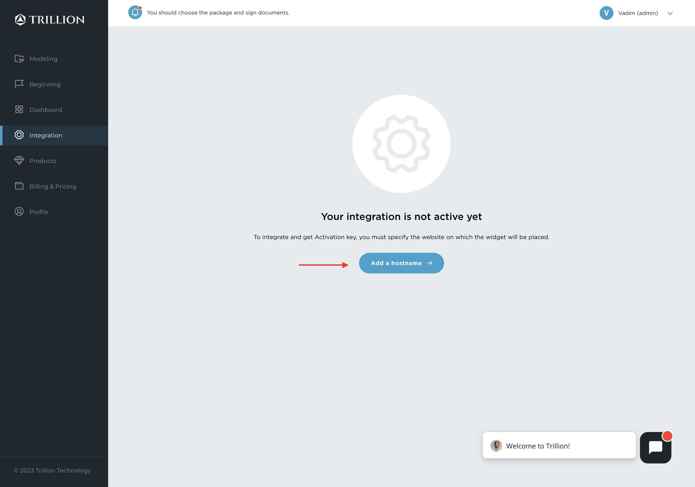
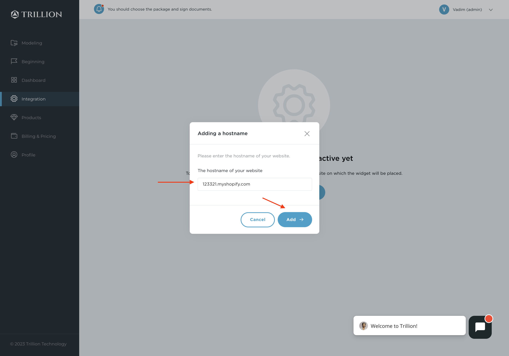
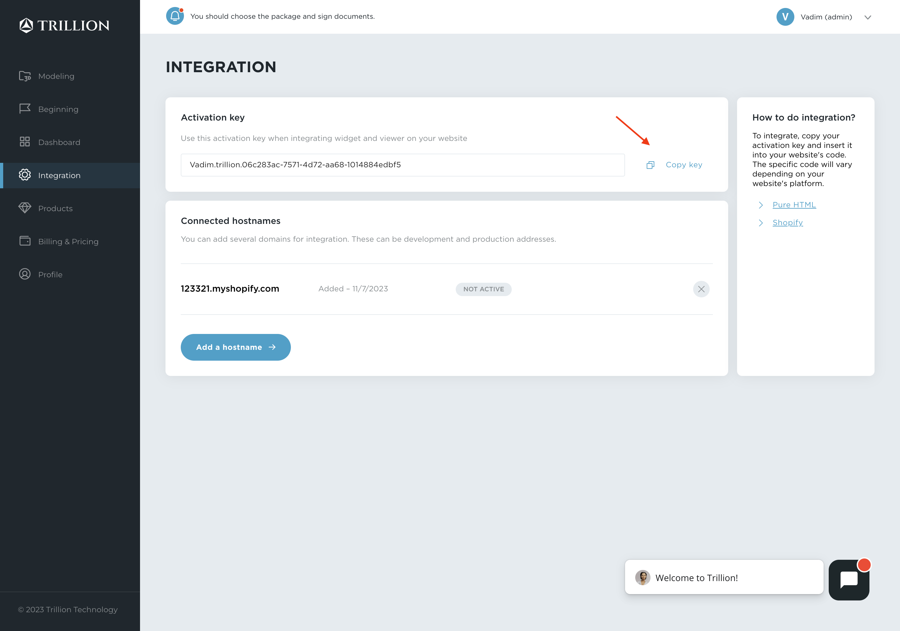

# Trillion Integration SDK

With checkJewelryExist method you can check if jewelryId exist in our database and then use it for setJewelryId method.

## Prerequisites

- You have an account on the [Trillion Dashboard](https://dashboard.trillion.jewelry "Go to dashboard")
- You have purchased a package that includes the service you want (3D Viewer or AR Try-on)
- You have at least one product that has "Done" status and has been published

## AR Try-On

You need to create an empty div element for AR widget initialization. For example:

In your html:

```html
<div id="trillion-widget"></div>
```

In your script:

```javascript
import {TrillionWidgetApp} from "trillion-widget"
import {jewelryExists} from "./checkJewelryExist.js"


const jewelryId = 'my_ring'
const elem = document.getElementById('trillion-widget')
const trillionWidget = new TrillionWidgetApp()
const activationKey = 'PASTE_YOUR_ACTIVATION_KEY_HERE'

if (jewelryExists(jewelryID)) {
  trillionWidget.init(elem)
  trillionWidget.setServiceActivationKey(activationKey)
  trillionWidget.setJewelryID(jewelryId)
  trillionWidget.refresh()
}
```

For more methods please visit our library package page - <https://www.npmjs.com/package/trillion-widget>

## 3D Viewer

You need to create an empty div element for AR widget initialization. For example:

In your html:

```html
<div id="trillion-viewer"></div>
```

In your script:

```javascript
import {TrillionViewerApp} from "trillion-viewer"
import {jewelryExists} from "./checkJewelryExist.js"

const jewelryId = 'my_ring'
const elem = document.getElementById('trillion-viewer')
const trillionViewer = new TrillionViewerApp()
const activationKey = 'PASTE_YOUR_ACTIVATION_KEY_HERE'

if (jewelryExists(jewelryID)) {
  trillionViewer.init(elem)
  trillionViewer.setServiceActivationKey(activationKey)
  trillionViewer.setJewelryID(jewelryID)
  trillionViewer.refresh()
}
```

For more methods please visit our library package page - <https://www.npmjs.com/package/trillion-viewer>

## Get your Activation key

- Go to [Trillion Dashboard/Integration](https://dashboard.trillion.jewelry/integration "Go to dashboard")
- Click "Add a hostname"



- Enter your site hostname and click "Add"



- Click the "Copy key" button in the Activation key section


